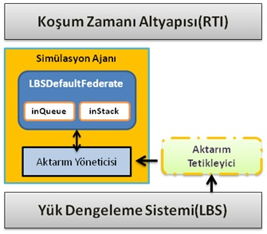
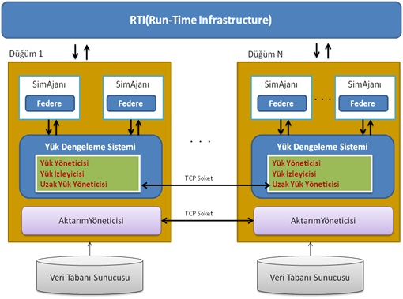

Dynamic Load Balancing on High Level Architecture Based Simulations

Computer simulations are used in many fields today, in order to evaluate and analyze properties and behavior of the system by modelling a theoretical or a real physical system on the computer environment. The simulation applications using complex calculation methods need high computing power to produce better results. Since individual processors have limited capacities and those of high computing capacity are costly, effective use of multiple processor option becomes viable.
In this case, the distributed programming architecture approach is used to meet the needs of high computing power. With this approach, it is possible to use combination of multiple computing resources, in the form of a network or a distributed system.
In distributed environment, it is possible for some computers to be overloaded, while others under loaded. To remedy this problem, load balancing is needed. 
Within the scope of this study, the work on HLA based dynamic load balancing have been studied, consequently a new dynamic load balancing approach has been proposed.
As an example application, on RTI (Run Time Infrastructure), a wireless sensor network simulation is chosen.  The load balancing algorithm utilises migration of federate state, in case of imbalance. The results show that the load balancing under certain conditions can provide higher performance compared to alternative.

Dependencies:
Portico HLA version portico-1.0.2
http://www.porticoproject.org/

Keywords:Portico, HLA(High Level Architecture), RTI, Dynamic Load Balancing, State Migration, Federate Migration

